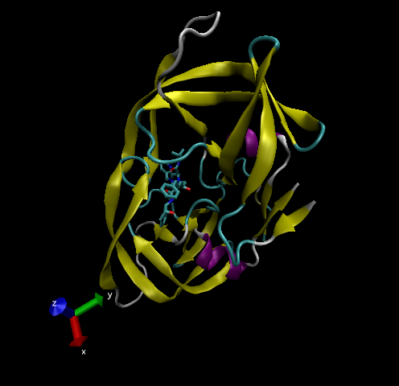

# Intro to RCSB Protein Data Bank

## PDB Statistics

Examine the CSV file taken from the PDB site.
```{r}
pdb <- read.csv("Data_Export_Summary.csv", row.names = 1)
pdb
```


**Q1: What percentage of structures in the PDB are solved by X-Ray and Electron Microscopy?**
```{r}
totals <- colSums(pdb)
totals/totals["Total"] * 100
```

About 87.17% of structures in the PDB are solved by X-Ray and 5.39% by Electron Microscopy.


**Q2: What proportion of structures in the PDB are protein?**
```{r}
#proportion
pdb$Total[1] / sum(pdb$Total)
```

About 87.26% of the PDB structures are proteins.


**Q3: Type HIV in the PDB website search box on the home page and determine how many HIV-1 protease structures are in the current PDB?**

In the current PDB, there are 860 HIV-1 protease structures.


# Visualizing the HIV-1 Protease Structure

## Using Atom Selection

**Q4: Water molecules normally have 3 atoms. Why do we see just one atom per water molecule in this structure?**

In the structure, only the oxygen atoms are visualized, with the two hydrogen atoms not being included. This means there will only be one atom for each water molecule.


**Q5: There is a conserved water molecule in the binding site. Can you identify this water molecule? What residue number does this water molecule have (see note below)?**

The residue number is HOH332.


**Optional: Generate and save a figure clearly showing the two distinct chains of HIV-protease along with the ligand.**



Discussion Topic: Can you think of a way in which indinavir, or even larger ligands and substrates, could enter the binding site?


# Intro to Bio3D in R

## Reading PDB File Data into R

Load the Bio3D package!
```{r}
#install.packages("bio3d")
library(bio3d)
```

Read a PDB file into R. 
```{r}
hsg <- read.pdb("1hsg")
hsg
```


**Q7: How many amino acid residues are there in this pdb object?**

There are 198 amino acid residues in this object.


**Q8: Name one of the two non-protein residues?** 

One of the non-protein residues is HOH, known as water.


**Q9: How many protein chains are in this structure?**

There are 2 protein chains.


Examine some of the attributes of the PDB object.
```{r}
attributes(hsg)
```
```{r}
head(hsg$atom)
```


# Comparative Structure Analysis of Adenylate Kinase

## Set-up

Install the following in the R console.
```{r}
#install.packages("ggrepel")
#install.packages("devtools")
#install.packages("BiocManager")

#BiocManager::install("msa")
#devtools::install_bitbucket("Grantlab/bio3d-view")
```


**Q10. Which of the packages above is found only on BioConductor and not CRAN?**

The "msa" package is found only on BioConductor.


**Q11. Which of the above packages is not found on BioConductor or CRAN?** 

The "bio3d-view" package isn't found on either BioConductor or CRAN.


**Q12. True or False? Functions from the devtools package can be used to install packages from GitHub and BitBucket?**

TRUE.


## Search & Retrieve ADK Structures

First, we need to find the sequence of chain A of 1AKE.
```{r}
aa <- get.seq("1ake_A")
```
```{r}
aa
```

**Q13. How many amino acids are in this sequence, i.e. how long is this sequence?**

There are 214 amino acids in the sequence.


Now we can use this sequence to BLAST search the PDB database to find similar sequences.
```{r}
aa_blast <- blast.pdb(aa)
```

We can visualize and filter the BLAST results using the function plot.blast().
```{r}
hits <- plot.blast(aa_blast)
```

Here, we can see the top scoring hits from the BLAST results.
```{r}
head(hits$pdb.id)
```

With the above information, we can use get.pdb() to fetch and parse the dientified structures.
```{r}
# Download releated PDB files
files <- get.pdb(hits$pdb.id, path = "pdbs", split = TRUE, gzip = TRUE)
```


## Align and Superpose Structures

The code below will align and fit the identified PDB structures.
```{r}
#align PDBs
pdbs <- pdbaln(files, fit = TRUE, exefile = "msa")

#vector containing PDB codes for figure axis
ids <- basename.pdb(pdbs$id)

#draw schematic alignment
plot(pdbs, labels = ids)
```


## Viewing the Superposed Structures [OPTIONAL]

```{r}
#install.packages("devtools")
#library(devtools)
#install_bitbucket("Grantlab/bio3d-view")
#install.packages("rgl")

library(bio3d.view)
library(rgl)

view.pdbs(pdbs)
```

[viewer works! :)]


## Annotate PDB Structures

The functions below help us annotate the PDB structures so we can associate each structure with its source species.
```{r}
anno <- pdb.annotate(c("2mh3_A", "4f3l"), anno.terms = c("structureId", "experimentalTechnique", "resolution","pfam", "source", "citation"))
anno
```


## Principal Component Analysis

We can use PCA on the identified PDBs in order to determine any significant structural variations.
```{r}
pc.xray <- pca(pdbs)
plot(pc.xray)
```

We can calculate the pairwise RMSD values of the structures, which can help with clutering analysis.
```{r}
#calculate RMSD
rd <- rmsd(pdbs)

#structure-based clustering
hc.rd <- hclust(dist(rd))
grps.rd <- cutree(hc.rd, k = 3)

plot(pc.xray, 1:2, col="grey50", bg = grps.rd, pch = 21, cex = 1)
```

# Normal Mode Analysis [OPTIONAL]

Normal Mode Analysis on PDBs can help with characterizing the profiles of related protein structures.
```{r}
modes <- nma(pdbs)
plot(modes, pdbs, col = grps.rd)
```

**Q14. What do you note about this plot? Are the black and colored lines similar or different? Where do you think they differ most and why?**

The black lines and colored lines differ at certain regions, particularly from around residue numbers 30-70 and residue numbers 125-175. These differences may be due to those residues being associated with ligand binding sites for the structures represented by the colored lines.