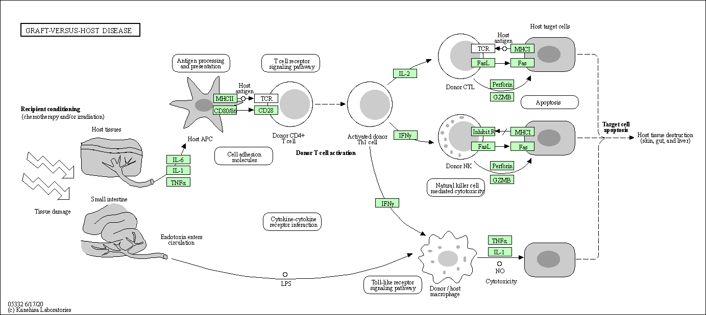

# Bioconductor & DESeq Set-up

Install the necessary packages! Code below input into *R console*.

```{r}
#install.packages("BiocManager")
#BiocManager::install()
#BiocManager::install("DESeq2")
```

Check that the packages were installed correctly.
```{r}
library(BiocManager)
library(DESeq2)
```


# Import Data

```{r}
counts <- read.csv("airway_scaledcounts.csv", row.names = 1)
metadata <-  read.csv("airway_metadata.csv")

head(counts)
head(metadata)
```


**Q1. How many genes are in this dataset?**

```{r}
nrow(counts)
```

There are 38694 genes.


**Q2. How many ‘control’ cell lines do we have?**

```{r}
sum(metadata$dex == "control")
```

There are 4 'control' cell lines.


# Differential Gene Expression DEMO

Find the sample ID for the control cell lines, then calculate the mean counts per gene for these samples.

```{r}
control <- metadata[metadata[,"dex"] == "control",]
control.counts <- counts[ , control$id]
control.mean <- rowSums( control.counts ) / 4 
head(control.mean)
```

The code below accomplishes the same task, except it uses the dplyr package.

```{r}
library(dplyr)
control <- metadata %>% filter(dex == "control")
control.counts <- counts %>% select(control$id) 
control.mean <- rowSums(control.counts) / 4
head(control.mean)
```

Using the dplyr package to accomplish this task is preferable because the filtering of the data to identify the right samples is more intuitive than the syntax from the previous example.

**Q3. How would you make the above code in either approach more robust?**

I'd make the code more robust by changing the '4' to 'ncol(control.counts)' so that if the number of control samples were changed, the mean would still be calculated accordingly. Refer below.

```{r}
control.mean <- rowSums(control.counts) / ncol(control.counts)
head(control.mean)
```


**Q4. Follow the same procedure for the treated samples (i.e. calculate the mean per gene across drug treated samples and assign to a labeled vector called treated.mean)**

```{r}
treated <- metadata %>% filter(dex == "treated")
treated.counts <- counts %>% select(treated$id) 
treated.mean <- rowSums(treated.counts) / ncol(treated.counts)
names(treated.mean) <- counts$ensgene
head(treated.mean)
```

Comparing By raw counts is problematic, especially if we sequence one group at a greater depth. A better approach would be to normalize by sequencing depth per sample, which will be done later. 

```{r}
meancounts <- data.frame(control.mean, treated.mean)
colSums(meancounts)
```


**Q5 (a). Create a scatter plot showing the mean of the treated samples against the mean of the control samples.**

```{r plots}
plot(meancounts, xlab = "Control", ylab = "Treated")
```

**Q5 (b).You could also use the ggplot2 package to make this figure producing the plot below. What geom_?() function would you use for this plot?**

You would use geom_point().

```{r}
library(ggplot2)
ggplot(meancounts) +
  aes(x = control.mean, y = treated.mean) + 
  geom_point()
```

**Q6. Try plotting both axes on a log scale. What is the argument to plot() that allows you to do this?**

For plot(), you can use the 'log' argument. For ggplot(), you can use 'scale_x_continuous(trans = "log2")' and 'scale_y_continuous(trans = "log2")'.

```{r warning=FALSE}
plot(meancounts, xlab = "Control", ylab = "Treated", log = "xy")
```


Look for genes with large changes between control and treated samples (use log2 of fold changes!). These can be candidate differentially expressed genes.

```{r diff exp}
meancounts$log2fc <- log2(meancounts[,"treated.mean"] / meancounts[,"control.mean"])
head(meancounts)
```

Find the genes that have unwanted values (ie. control.mean or untreated mean being 0) and remove them from the results.

```{r}
zero.vals <- which(meancounts[,1:2] == 0, arr.ind = TRUE)

to.rm <- unique(zero.vals[,1])
mycounts <- meancounts[-to.rm,]
head(mycounts)
```

**Q7. What is the purpose of the arr.ind argument in the which() function call above? Why would we then take the first column of the output and need to call the unique() function?**

The arr.ind argument determines whether the which() function should return the value of the index values. Setting it to TRUE means the which() function above will return the indices of the row (gene) and column (sample) where the conditions (control.mean == 0 or treated.mean == 0) are met.

We want to remove the genes that have a 0 count, so we should remove the rows that have a 0. As such, we use the first column of the output, since this corresponds to the rows. We use the unique() function to make sure we don't count a row (gene) twice,


Filter the dataset to see how many genes are up-regulated and down-regulated!

```{r up and down reg}
up.ind <- mycounts$log2fc > 2
down.ind <- mycounts$log2fc < (-2)
```

**Q8. Using the up.ind vector above can you determine how many up regulated genes we have at the greater than 2 fc level?**

```{r}
sum(up.ind)
```

There are 250 up-regulated genes.

**Q9. Using the down.ind vector above can you determine how many down regulated genes we have at the greater than 2 fc level?**

```{r}
sum(down.ind)
```

There are 367 down-regulated genes.

**Q10. Do you trust these results? Why or why not?**

No I don't trust these results because (1) these values were calculated using raw counts, which as stated previously, doesn't consider sequence depth and (2) the values weren't determined to be statistically significant, meaning we don't know if these values actually indicate differentially expressed genes.


# DESeq Analysis

```{r}
citation("DESeq2")
```


The DESeqDataSet is a single object that contains input values, intermediate calculations like how things are normalized, and all results of a differential expression analysis.

You can construct a DESeqDataSet from (1) a count matrix, (2) a metadata file, and (3) a formula indicating the design of the experiment.

```{r dseq}
dds <- DESeqDataSetFromMatrix(countData = counts, 
                              colData = metadata, 
                              design=~dex)
dds
```


Run the DESeq() on dds. This function calls a number of other functions within the package to essentially run the entire DESeq pipeline. Extract the results using results().

```{r}
dds <- DESeq(dds)
```

```{r}
res <- results(dds)
res
```


Convert res to a data frame and view the results.

```{r}
res.df <- as.data.frame(res)
View(res.df)
```

The results function contains a number of arguments to customize the results table. By default the argument alpha is set to 0.1. If the adjusted p value cutoff will be a value other than 0.1, alpha should be set to that value

```{r}
res05 <- results(dds, alpha = 0.05)
summary(res05)
```


# Adding Annotation Data

Load annotation packages to help with mapping IDs between different naming schemes.

```{r}
library("AnnotationDbi")
library("org.Hs.eg.db")
```


Below are all the avilable key types we could map between.

```{r}
columns(org.Hs.eg.db)
```

We can use the mapIds() function to add individual columns to our results table. We provide the row names of our results table as a key, and specify that keytype=ENSEMBL. The column argument tells the mapIds() function which information we want, and the multiVals argument tells the function what to do if there are multiple possible values for a single input value. 

```{r}
res$symbol <- mapIds(org.Hs.eg.db,
                     keys = row.names(res), 
                     keytype = "ENSEMBL",
                     column = "SYMBOL",
                     multiVals = "first")
```

```{r}
head(res)
```


**Q11. Run the mapIds() function three more times to add the Entrez ID and UniProt accession and GENENAME as new columns called res$entrez, res$uniprot and res$genename.**

```{r mapping}
res$entrez <- mapIds(org.Hs.eg.db,
                     keys = row.names(res), 
                     keytype = "ENSEMBL",
                     column = "ENTREZID",
                     multiVals = "first")

res$uniprot <- mapIds(org.Hs.eg.db,
                     keys = row.names(res), 
                     keytype = "ENSEMBL",
                     column = "UNIPROT",
                     multiVals = "first")

res$genename <- mapIds(org.Hs.eg.db,
                     keys = row.names(res), 
                     keytype = "ENSEMBL",
                     column = "GENENAME",
                     multiVals = "first")
```

```{r}
head(res)
```

Arrange and view by adjusted p-value!

```{r}
ord <- order(res$padj)
head(res[ord,])
```

Write the ordered significant results with annotations.

```{r}
write.csv(res[ord,], "deseq_results1.csv")
```


# Data Visualization - Volcano Plots

Volcano plots are used to highlight the proportion of genes that are both significantly regulated and display a high fold change. Typically these plots shows the log fold change on the X-axis, and the −log10 of the p-value on the Y-axis.

```{r}
plot( res$log2FoldChange,  -log(res$padj), 
      xlab = "Log2(FoldChange)",
      ylab = "-Log(P-value)")
```

Add cut off lines and color to make data visualization easier!

```{r}
#custom point color vector 
mycols <- rep("gray", nrow(res))
mycols[ abs(res$log2FoldChange) > 2 ]  <- "red" 

inds <- (res$padj < 0.01) & (abs(res$log2FoldChange) > 2 )
mycols[inds] <- "blue"

#plot with custom colors 
plot( res$log2FoldChange,  -log(res$padj), 
 col = mycols, ylab = "-Log(P-value)", xlab = "Log2(FoldChange)" )

#add cut-off lines
abline(v = c(-2,2), col = "darkgray", lty = 2)
abline(h = -log(0.05), col = "darkgray", lty = 2)
```

Use ENhanvedVolcano for more customization!

```{r}
library(EnhancedVolcano)
df <- as.data.frame(res)

EnhancedVolcano(df,
    lab = df$symbol,
    x = 'log2FoldChange',
    y = 'pvalue')
```


# Pathway Analysis

The KEGG pathway database, unlike GO for example, provides functional annotation as well as information about gene products that interact with each other in a given pathway, how they interact (e.g., activation, inhibition, etc.), and where they interact (e.g., cytoplasm, nucleus, etc.). Hence KEGG has the potential to provide extra insight beyond annotation lists of simple molecular function, process etc. from GO terms.

So set up the KEGG data sets needed!

```{r}
library(pathview)
library(gage)
library(gageData)

data(kegg.sets.hs)

#examine the first 2 pathways in this kegg set for humans
head(kegg.sets.hs, 2)
```

The main gage() function requires a named vector of fold changes, where the names of the values are the Entrez gene IDs.

```{r}
foldchanges = res$log2FoldChange
names(foldchanges) = res$entrez
head(foldchanges)
```

Now run the gage pathway analysis!

```{r}
keggres = gage(foldchanges, gsets=kegg.sets.hs)
```

```{r}
attributes(keggres)

# Look at the first three down (less) pathways
head(keggres$less, 3)
```


Now, let’s try out the pathview() function to make a pathway plot with our RNA-Seq expression results shown in color.

```{r}
pathview(gene.data = foldchanges, pathway.id = "hsa05310")
```


**Q12. Can you do the same procedure as above to plot the pathview figures for the top 2 down-reguled pathways?**

```{r}
pathview(gene.data = foldchanges, pathway.id = "hsa05332")
pathview(gene.data = foldchanges, pathway.id = "hsa04940")
```




# Plotting Counts for Gene of Interest

First, find the gene ID for the CRISPLD2 genes.

```{r}
i <- grep("CRISPLD2", res$symbol)
res[i,]
```

```{r}
rownames(res[i,])
```

Now plot the counts! plotCounts() takes a DESeqDataSet that has been run through the pipeline, the name of a gene, and the name of the variable in the colData that you’re interested in, and plots those values.

```{r}
plotCounts(dds, gene = "ENSG00000103196", intgroup = "dex")
```

Returns the counts as a data frame.

```{r}
d <- plotCounts(dds, gene = "ENSG00000103196", intgroup = "dex", returnData = TRUE)
```

Now we can make a boxplot and ggplot of the data.

```{r}
boxplot(count ~ dex , data = d)

ggplot(d, aes(dex, count, fill = dex)) + 
  geom_boxplot() + 
  scale_y_log10() + 
  ggtitle("CRISPLD2")
```

